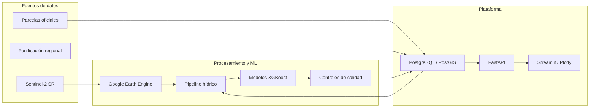

# OSMOSENSE

<p align="center">
  
</p>

### Monitoreo y predicción de estrés hídrico en viñedos y olivares

OSMOSENSE es una plataforma geoespacial de apoyo a decisiones que transforma
observaciones satelitales Sentinel-2 en indicadores de riesgo hídrico actual,
proyecciones a 5 y 10 días y rankings de atención para parcelas agrícolas de
San Rafael, Mendoza.

El sistema integra procesamiento remoto en Google Earth Engine, modelos de
aprendizaje automático, persistencia geoespacial en PostGIS, una API FastAPI y
un dashboard Streamlit con experiencias diferenciadas para productores,
usuarios regionales y administradores.

> Proyecto de tesis de grado de Ingeniería en Informática. El objetivo es
> complementar el criterio agronómico con información satelital comparable y
> actualizable; no reemplazar mediciones de campo ni indicar automáticamente
> cuándo regar.

## Problema y propuesta

El seguimiento parcela por parcela puede ser costoso, discontinuo y difícil de
escalar. Además, cuando el estrés ya es visualmente evidente, parte de la
capacidad de reacción puede haberse perdido.

OSMOSENSE procesa series temporales multiespectrales para:

- estimar un riesgo hídrico relativo dentro de cada cultivo y fecha;
- anticipar su evolución a 5 y 10 días;
- priorizar parcelas y unidades regionales que requieren atención;
- comunicar fecha de observación, cobertura y confianza del resultado;
- ofrecer una lectura operativa mediante mapas, tablas y gráficos.

## Capacidades principales

- Extracción de índices espectrales Sentinel-2 mediante Google Earth Engine.
- Análisis independiente para vid y olivo.
- Modelos XGBoost de regresión para horizontes de 5 y 10 días.
- Ranking hídrico actual y proyectado por parcela.
- Controles de cobertura, vecinos espaciales y persistencia temporal de
  valores atípicos.
- Agregación regional por unidades de manejo (UM).
- API autenticada y autorización por roles.
- Dashboard geoespacial para `admin`, `productor` y `regional`.
- Persistencia histórica y consultas espaciales con PostgreSQL/PostGIS.
- Pipeline y copias de respaldo automatizables mediante servicios `systemd`.

## Resultados de validación

La evaluación histórica multifecha compara predicciones con observaciones
Sentinel-2 futuras. Los resultados globales documentados son:

| Horizonte | Fechas evaluadas | MAE | RMSE | Spearman | Coincidencia top 10 % |
| --- | ---: | ---: | ---: | ---: | ---: |
| 5 días | 25 | 4,079 | 5,865 | 0,958 | 83,5 % |
| 10 días | 25 | 4,659 | 6,663 | 0,951 | 81,7 % |

El MAE se expresa en puntos sobre una escala de riesgo de 0 a 100. Spearman
mide la capacidad de conservar el orden relativo de las parcelas, una propiedad
central para generar prioridades de atención.

La metodología, el desglose por cultivo y estación y las limitaciones de la
evaluación están disponibles en
[Validación del predictor hídrico](docs/validacion_predictor_hidrico.md) y
[Modelo predictivo](docs/modelo_predictivo.md).

## Arquitectura



Google Earth Engine concentra el procesamiento multiespectral pesado. PostGIS
mantiene parcelas, usuarios, observaciones, rankings y geometrías. FastAPI
desacopla esa persistencia del dashboard y aplica autenticación y permisos.

Los diagramas del pipeline, autenticación, modelo de datos y navegación están
en [Diagramas del sistema](docs/diagramas.md).

## Experiencias por rol

### Productor

- Consulta exclusivamente las parcelas asociadas a su cuenta.
- Visualiza condición actual y proyecciones a 5 y 10 días.
- Compara prioridades, evolución temporal y detalle espectral.

### Regional

- Analiza unidades regionales y cobertura disponible.
- Identifica concentración de parcelas con riesgo alto o crítico.
- Profundiza desde el agregado regional hasta las parcelas que lo componen.

### Administrador

- Gestiona usuarios, productores y asignaciones de parcelas.
- Revisa cobertura, calidad de datos y estado del pipeline.
- Administra parcelas disponibles y activas.

## Tecnologías

| Área | Tecnologías |
| --- | --- |
| Lenguaje y datos | Python, Pandas, NumPy, SciPy |
| Geoespacial | Google Earth Engine, GeoPandas, Shapely, PostGIS |
| Machine Learning | XGBoost, scikit-learn, Joblib |
| Backend | FastAPI, Uvicorn, Psycopg |
| Dashboard | Streamlit, Plotly |
| Infraestructura | Docker Compose, Ubuntu, systemd |
| Calidad | Pytest, smoke tests y auditorías espaciales/temporales |

## Alcance y limitaciones

- Área operativa: San Rafael, Mendoza, Argentina.
- Cultivos actuales: vid y olivo.
- Fuente principal de parcelas: datos oficiales de IDEMendoza.
- Fuente satelital: `COPERNICUS/S2_SR_HARMONIZED`.
- El riesgo es un proxy satelital relativo por cultivo y fecha.
- No representa una medición fisiológica directa de campo.
- No pronostica sequía meteorológica.
- No prescribe riego ni sustituye el conocimiento del productor o especialista.
- La calidad depende de cobertura satelital válida, nubosidad y disponibilidad
  histórica por parcela.

## Estructura del repositorio

```text
.
├── backend/
│   ├── app/          # API y servicios
│   ├── models/       # Configuración y modelos locales
│   ├── scripts/      # Pipeline, auditorías, modelado y mantenimiento
│   └── sql/          # Esquema PostGIS
├── frontend/         # Dashboard Streamlit
├── deployment/       # Scripts y unidades systemd
├── docs/             # Metodología y documentación técnica
├── legacy/           # Experimentos históricos conservados como referencia
├── tests/            # Pruebas automatizadas
├── streamlit_app.py  # Entrada del dashboard
└── docker-compose.postgis.yml
```

## Preparar un entorno de desarrollo

### Requisitos

- Python 3.10 o superior.
- Docker Engine con Docker Compose.
- Cuenta y proyecto de Google Earth Engine.
- Ubuntu 22.04 o superior como entorno de referencia.

### Instalación base

```bash
git clone https://github.com/EmilianoMunoz/osmosense.git
cd osmosense
python3 -m venv venv
source venv/bin/activate
pip install -r requirements.txt
pip install -e .
cp .env.local.example .env
earthengine authenticate
```

Con los artefactos operativos disponibles, el entorno completo se inicia con:

```bash
./boot.sh start
```

Los datasets geoespaciales, rankings y modelos binarios pesados son artefactos
locales o regenerables y no se versionan. La preparación de PostGIS y la
reconstrucción de datos se explican en:

- [Reconstrucción del dataset desde IDEMendoza](docs/reconstruccion_dataset_desde_ide.md)
- [Persistencia PostGIS](docs/postgis.md)
- [Comandos operativos](docs/comandos.md)
- [Artefactos operativos](docs/artefactos_operativos.md)

## Verificación

Pruebas automatizadas:

```bash
venv/bin/python -m pytest -q
```

Validación operativa contra una API y PostGIS ya levantados:

```bash
venv/bin/python backend/scripts/postgis/smoke_test_operativo.py --require-source postgis
```

El alcance de cada prueba está documentado en
[Pruebas y validaciones](docs/tests.md).

## Despliegue

El sistema fue preparado y validado en una VM Ubuntu de UM-Cloud con PostGIS en
Docker, FastAPI y Streamlit como servicios `systemd`, ejecución programada del
pipeline y copias de respaldo automatizadas.

La documentación operativa de despliegue se conserva separada del flujo de
inicio rápido. Antes de reutilizarla en otro entorno deben revisarse accesos,
redes, credenciales y políticas institucionales.

## Documentación

La documentación está organizada por producto, metodología, datos, seguridad y
operación en el [índice de documentación](docs/README.md).

Entradas recomendadas:

- [Contexto de tesis](docs/contexto_tesis.md)
- [Decisiones técnicas](DECISIONS.md)
- [Modelo predictivo](docs/modelo_predictivo.md)
- [Validación del predictor](docs/validacion_predictor_hidrico.md)
- [Arquitectura cloud del pipeline](docs/arquitectura_cloud_pipeline.md)
- [API](docs/api.md)
- [Dashboard](docs/dashboard.md)
- [Seguridad y autenticación](docs/seguridad_auth.md)

## Estado del proyecto

Los flujos principales de extracción satelital, cálculo de indicadores,
predicción, ranking, persistencia, API y visualización están implementados. Las
líneas de evolución se mantienen en [Trabajo futuro](docs/FUTURE.md).

## Autor

Desarrollado por **Emiliano Muñoz** como proyecto de tesis de grado de
Ingeniería en Informática.
