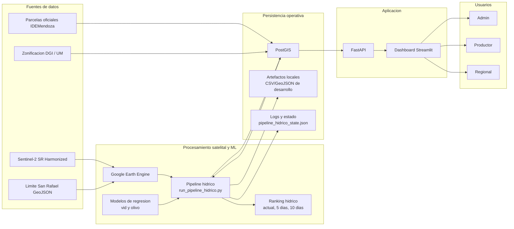
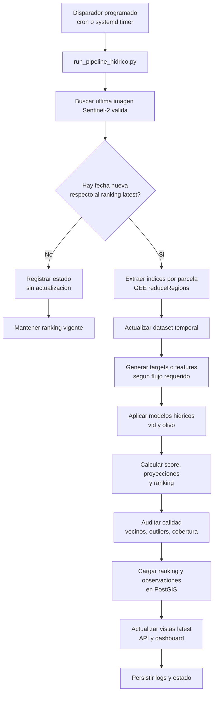
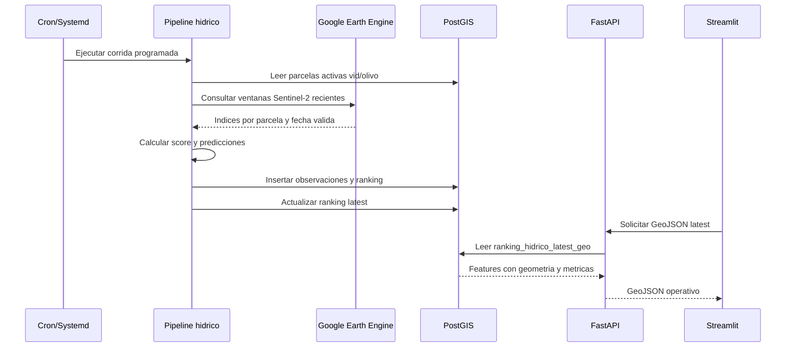
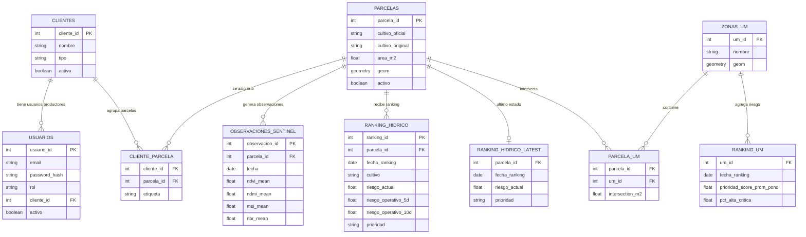
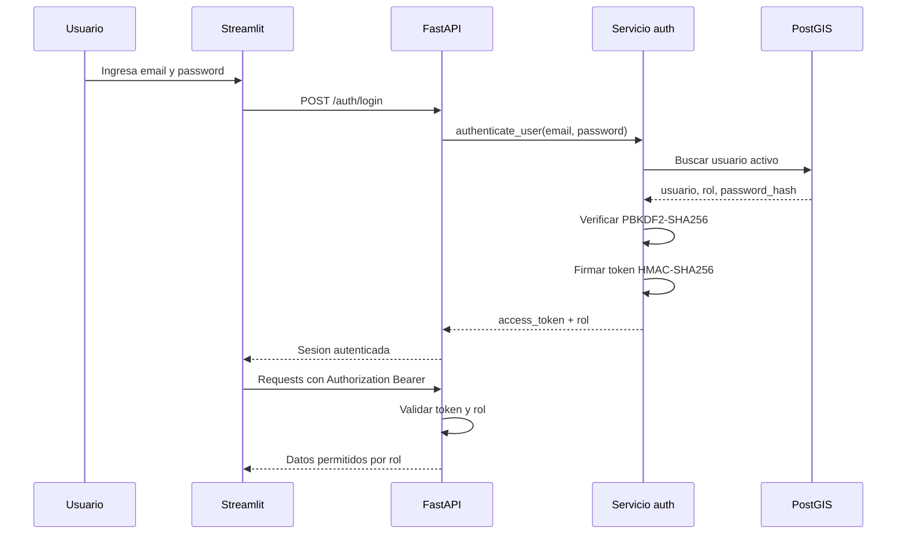
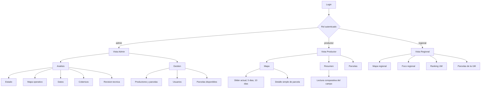
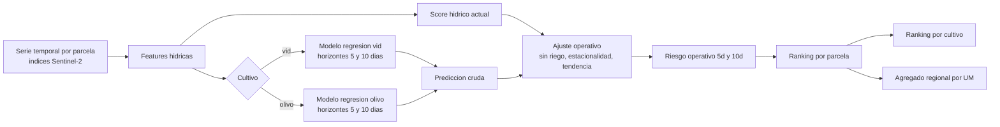
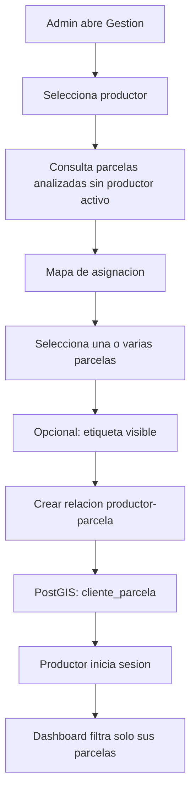
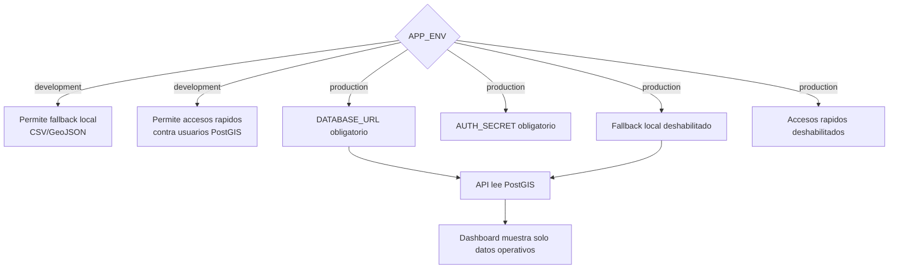

# Diagramas Del Sistema

Este documento contiene diagramas en formato Mermaid para explicar la
arquitectura, el pipeline, la base de datos y las vistas del sistema. Estan
pensados como insumo para la tesis y para documentacion tecnica.

Los diagramas reflejan el flujo operativo actual:

- PostGIS es la fuente productiva.
- Los CSV/GeoJSON locales quedan solo como fallback de desarrollo.
- La clasificacion queda como soporte metodologico/experimental.
- El producto operativo se concentra en riesgo hidrico para vid y olivo.

## 1. Arquitectura General

Lectura metodologica: Google Earth Engine concentra el procesamiento
multiespectral pesado, mientras que UM-Cloud/PostGIS conserva el estado
operativo. La API desacopla el almacenamiento geoespacial del dashboard.

## 2. Pipeline Operativo

Decision clave: el pipeline no asume que "hoy" tiene imagen valida. Busca la
ultima observacion Sentinel-2 util y solo recalcula si existe una fecha nueva.
Esto evita reescribir rankings con datos repetidos o de mala calidad.

## 3. Flujo De Datos Sentinel-2

Uso en tesis: este diagrama muestra la separacion entre procesamiento remoto
en GEE, persistencia geoespacial en PostGIS y visualizacion en el dashboard.

## 4. Modelo De Datos PostGIS

Nota: `clientes` y `cliente_parcela` conservan nombres legacy internos. En la
interfaz se presentan como productores y parcelas asignadas.

## 5. Autenticacion Y Permisos

Reglas vigentes:

- `admin`: acceso a ranking global, gestion de usuarios, productores y parcelas.
- `productor`: acceso solo a parcelas asociadas a su cartera interna.
- `regional`: acceso a agregados por UM y ranking regional.

En produccion, `AUTH_SECRET` es obligatorio. Si falta, la API no debe firmar ni
validar tokens con un secreto de desarrollo.

## 6. Navegacion Del Dashboard

Decision de diseño: la vista Admin separa analisis y gestion para evitar una
pantalla inicial demasiado pesada. La vista Productor evita graficos tecnicos y
prioriza mensajes interpretables.

## 7. Modelo Predictivo Y Ranking

Interpretacion: los modelos aprenden la evolucion historica observada, pero la
visualizacion operativa usa una proyeccion ajustada para representar el
escenario de desmejora si la parcela no recibe intervencion.

## 8. Flujo Productor-Parcela

Este flujo permite incorporar parcelas ya analizadas a la cartera de un
productor sin modificar el ranking global ni recalcular inmediatamente el
modelo.

## 9. Produccion Vs Desarrollo

Esta separacion evita que el sistema productivo oculte una caida de API/PostGIS
mostrando artefactos locales viejos.

## Exportacion

Opciones practicas para usar estos diagramas en la tesis:

1. Abrir este archivo en VSCode con preview Mermaid.
2. Copiar cada bloque en <https://mermaid.live> y exportar como PNG o SVG.
3. Usar extensiones de Markdown/Mermaid para generar imagenes desde la tesis.

Para el marco metodologico conviene usar al menos:

- Arquitectura general.
- Pipeline operativo.
- Modelo de datos PostGIS.
- Autenticacion y permisos.
- Modelo predictivo y ranking.
